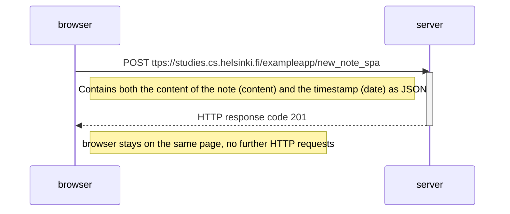

```mermaid
sequenceDiagram
    participant browser
    participant server

    browser->>server: POST ttps://studies.cs.helsinki.fi/exampleapp/new_note_spa
    activate server

    Note right of browser: Contains both the content of the note (content) and the timestamp (date) as JSON

    server-->>browser: HTTP response code 201
    deactivate server

    Note right of browser:  browser stays on the same page, no further HTTP requests
```
